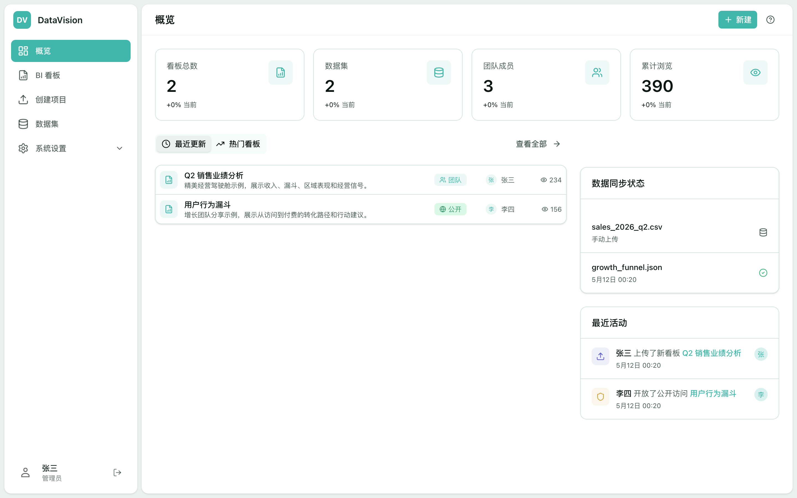
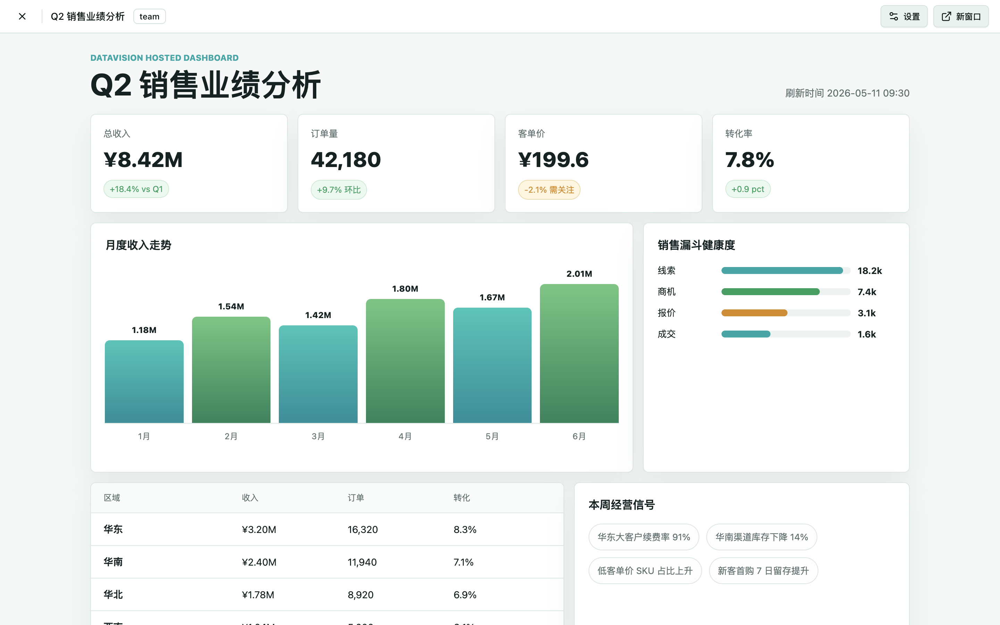

# Artifacta

**Still dragging widgets to build BI dashboards in the AI era?**  
That is last-generation production: slow, rigid, hard to collaborate, and hard to turn “insights the model just produced” into something you can actually ship.

Artifacta bets on a different path: **let AI write HTML dashboards**—charts, narrative, and interaction in one pass, an order of magnitude faster than dragging controls.

---

But you already know what HTML dashboards look like today:

- **Local file silos**—email attachments, shared drives, screenshots pasted into slides?
- Colleagues want to **view online**, but your machine has to stay on and paths have to line up?
- Data frozen in CSV files with **no scheduled refresh**, and no shared team source of truth?

**Artifacta fills that gap:** an **open protocol and hosting platform** for AI-generated data applications.

Upload your HTML or ZIP dashboard bundle, set who can see it and how data should update—especially well suited for:

- Team **HTML weekly or monthly reports**
- **HTML slide decks** (more alive than static PPT)
- Lightweight **BI dashboards**, analytics pages, and ops screens
- Anything you **build locally with AI first**, then need the team to use online

Generate with a local **Skill** in Cursor or Claude Code, then pack and upload with one CLI command; the platform handles hosting, permissions, dataset binding, and sync—turning “runs on my laptop” into “the team can open it anytime, and data can stay fresh.”

[中文说明](README.zh-CN.md)

## Preview





## What's Available Today

- Upload a single `.html` dashboard or a `.zip` bundle with CSS, JS, images, and other static assets.
- Preview dashboards in a sandboxed iframe with private, team, or public visibility.
- Upload CSV/JSON datasets with automatic row, column, and schema inspection.
- Manage folders, team members, project permissions, API keys, and dataset sync configuration.
- Use signed Cookie sessions in the web console; use Bearer API keys for coding agents, CI, and the CLI.
- Start with local JSON storage for zero friction, or switch to SQLite for a more production-like self-hosted setup.
- Built-in `artifacta` CLI, sync worker, and API smoke tests.

## Quick Start

Artifacta uses Node `24.16.0` and `pnpm@11.1.3`. The repo includes `packageManager`, `.node-version`, and `.nvmrc` so Corepack, `fnm`, `nvm`, and other managers can switch versions automatically.

```bash
corepack enable
pnpm install
cp .env.example .env.local
pnpm dev
```

Open `http://localhost:3000` and sign in with either demo account:

- `admin@artifacta.local`
- `lisi@artifacta.local`

The first request seeds a demo organization, users, folders, datasets, polished example dashboards, and local runtime data under `.artifacta`.

If you still have an older `.datavision` directory from a previous checkout, rename it to `.artifacta`, or point `DATA_DIR`, `UPLOAD_DIR`, and `SQLITE_PATH` at your existing paths until you finish migrating.

## Running With SQLite

JSON storage is the default for a quick first run. For a more production-like self-hosted setup, switch to SQLite:

```bash
DATA_DRIVER=sqlite \
SQLITE_PATH=.artifacta/artifacta.sqlite \
pnpm dev
```

The SQLite adapter includes idempotent migrations and reuses the same API and UI logic.

## CLI Workflow

Create an API key under `Settings -> API & CLI`, then:

```bash
export ARTIFACTA_URL=http://localhost:3000
export ARTIFACTA_API_KEY=art_...

pnpm cli -- projects list
pnpm cli -- projects upload --file ./dashboard.zip --name "Weekly Growth" --visibility team
pnpm cli -- projects update-html --project-id proj_123 --file ./dashboard-v2.zip
pnpm cli -- datasets upload --project-id proj_123 --file ./growth.csv --name "Weekly Growth Data"
pnpm cli -- datasets sync set --project-id proj_123 --dataset-id ds_123 --source-type presto --config-file ./sync.json
pnpm cli -- datasets list
pnpm cli -- doctor
pnpm cli -- --json projects list
```

The standalone CLI is published on npm as [`@artifacta/cli`](https://www.npmjs.com/package/@artifacta/cli). External users can install it without cloning the app:

```bash
npx @artifacta/cli@latest --help
```

Or install globally:

```bash
npm install -g @artifacta/cli
```

The CLI can create projects, replace dashboard HTML, upload or replace datasets, and submit dataset sync configuration JSON from a local skill or CI job.

For the zero-repo end-user path, see [docs/ONBOARDING.md](docs/ONBOARDING.md). For a copyable Claude Code skill template, see [templates/claude-code-artifacta-publisher/SKILL.md](templates/claude-code-artifacta-publisher/SKILL.md). Maintainers bumping a new release should follow [docs/CLI-RELEASE.md](docs/CLI-RELEASE.md).

## REST API Example

```bash
curl -X POST http://localhost:3000/api/v1/projects \
  -H "Authorization: Bearer $ARTIFACTA_API_KEY" \
  -F "name=Sales Dashboard" \
  -F "visibility=team" \
  -F "html_file=@./dashboard.zip" \
  -F "data_files=@./sales.csv"
```

See [docs/API.md](docs/API.md) for routes, request fields, and response shapes. The stable ZIP/bundle contract is [docs/protocol/manifest-v1.md](docs/protocol/manifest-v1.md).

## Examples

`examples/` includes a single-file HTML dashboard, a ZIP dashboard with CSS/JS/images, CSV and JSON datasets, a `mock_rows` sync config, and a CLI publish script:

```bash
export ARTIFACTA_URL=http://localhost:3000
export ARTIFACTA_API_KEY=art_live_...
bash examples/publish-example.sh
```

## Sync Worker

The worker drains bundle script jobs (`POST /sync/script-jobs/claim`), then per-dataset sync jobs, and enqueues due dataset syncs from `/datasets`.

```bash
export ARTIFACTA_API_KEY=art_...
pnpm worker:once
node scripts/sync-worker.mjs --interval 60
```

The current sync executor supports local files, uploaded artifact paths, URL fetches, and `mock_rows`. Real COS/S3 and Presto/Trino clients are intended to land as connector adapters behind the executor.

## Common Scripts

```bash
pnpm dev          # start the development server
pnpm build        # production build
pnpm start        # run the production build
pnpm typecheck    # TypeScript check
pnpm lint         # ESLint
pnpm test         # contract, client, security, and unit tests
pnpm test:api-contract # route / OpenAPI consistency guard
pnpm test:client   # @artifacta/client tests
pnpm test:security # ZIP, sync source, and upload-session security tests
pnpm test:unit    # sync jobs, manifest, CSV, rate limit, embed token, versions
pnpm test:smoke   # API smoke test against a running app
pnpm worker:once  # run one sync worker pass
```

## Configuration

| Variable | Default | Description |
| --- | --- | --- |
| `NEXT_PUBLIC_APP_URL` | `http://localhost:3000` | Public URL used when generating preview and API links. |
| `AUTH_SECRET` | development fallback | Session signing secret; use a strong random value in shared environments. |
| `DATA_DRIVER` | `json` | `json`, `sqlite`, or `postgres`. |
| `DATA_DIR` | `.artifacta` | Local metadata directory and default SQLite parent directory. |
| `SQLITE_PATH` | `.artifacta/artifacta.sqlite` | SQLite database path when `DATA_DRIVER=sqlite`. |
| `POSTGRES_URL` / `DATABASE_URL` | unset | Postgres connection string when `DATA_DRIVER=postgres`. |
| `UPLOAD_DIR` | `.artifacta/uploads` | Uploaded dashboard and dataset files. |
| `STORAGE_DRIVER` | `local` | `local` or `s3`. |
| `S3_BUCKET`, `S3_REGION`, `S3_ENDPOINT` | unset | S3-compatible object storage settings. |
| `ARTIFACTA_MAX_ARTIFACT_BYTES` | `104857600` | Max dashboard upload size. |
| `ARTIFACTA_MAX_DATASET_BYTES` | `52428800` | Max dataset upload size. |
| `OIDC_ISSUER_URL`, `OIDC_CLIENT_ID`, `OIDC_CLIENT_SECRET` | unset | Optional OIDC login configuration. |

## Code Layout

- `app/`: Next.js App Router pages, preview UI, and REST API routes.
- `lib/server/`: auth, access control, database adapters, storage, serializers, dataset inspection, and sync execution.
- `packages/cli/`: standalone publishable CLI; `bin/artifacta.mjs` is the repo-local wrapper entrypoint.
- `scripts/sync-worker.mjs`: API-key-driven sync worker.
- `.artifacta/`: local runtime data (not committed to Git).

See [docs/plans/2026-05-21-open-source-excellence-roadmap.md](docs/plans/2026-05-21-open-source-excellence-roadmap.md) for the roadmap and [docs/DEPLOYMENT.md](docs/DEPLOYMENT.md) for deployment. `docs/PLAN.md` is archived historical context.

## Documentation

- [docs/IMPLEMENTED-FEATURES.md](docs/IMPLEMENTED-FEATURES.md): code-to-docs checklist for pages, API routes, CLI, worker, and storage boundaries.
- [docs/DEVELOPMENT-ENVIRONMENT.md](docs/DEVELOPMENT-ENVIRONMENT.md): `fnm`, Node, and `pnpm` setup, including non-interactive shells that miss the environment.
- [docs/API.md](docs/API.md): human-readable API guide; [docs/openapi/artifacta.v1.yaml](docs/openapi/artifacta.v1.yaml): partial OpenAPI contract for integrations.
- [docs/PRODUCT.md](docs/PRODUCT.md): current MVP vs roadmap and enterprise extension points.
- [CONTRIBUTING.md](CONTRIBUTING.md), [SECURITY.md](SECURITY.md), [CHANGELOG.md](CHANGELOG.md): contribution, vulnerability reporting, and release notes.

## Current Boundaries

- OIDC login works when configured; SAML remains an extension point.
- SQLite suits self-hosted trials; Postgres metadata and S3-compatible object storage are available for production hardening.
- The worker runs local file, URL, `mock_rows`, S3/COS object, and Presto/Trino HTTP sync branches.

## License

MIT. See [LICENSE](LICENSE).
