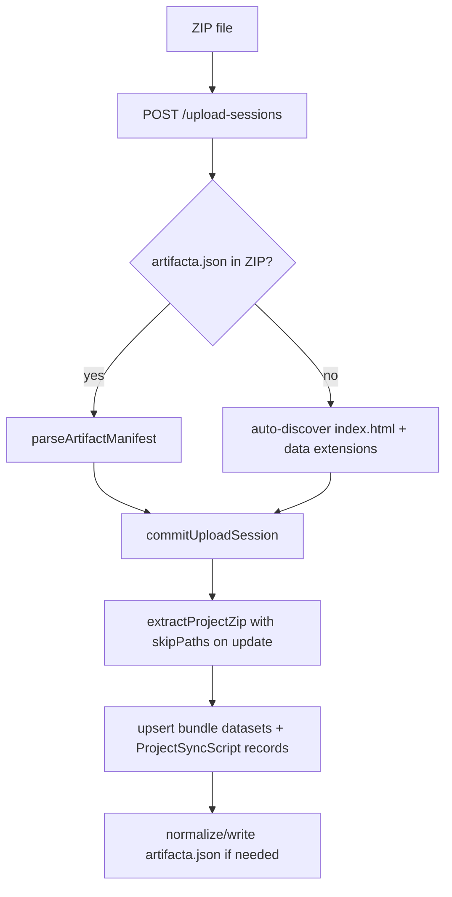

# Custom Script Sync & Bundle-First Upload

Date: 2026-05-24  
Status: **Design locked** — ready for implementation  
Agent skill: `templates/claude-code-artifacta-publisher/SKILL.md`

## Summary

1. **Bundle-first upload** — ZIP is the canonical artifact; deprecate HTML + separate `data_files`. Zero-config publish from bundled `artifacta.json` when present; otherwise auto-discover entry + data files. Settings UI for post-publish overrides.
2. **Custom script sync** — Run user scripts inside the extracted bundle on the platform (model A). One script run can update multiple files; user declares `outputs[]`. Scripts live in the bundle and **update with each ZIP upload**; synced output data paths stay protected on re-upload.
3. **Configuration** — `artifacta.json` defines `sync_scripts[]` defaults; server overrides schedule, secrets, and optional `outputs`. Secrets only in `sourceConfig`, injected as `ARTIFACTA_SOURCE_CONFIG`.

---

## Codebase baseline (2026-05-24)

What exists today — implementation must extend, not assume:

| Area | Current behavior | Gap |
|------|------------------|-----|
| **Web ZIP upload** | `POST /upload-sessions` → wizard → `commitUploadSession` | Works; always **overwrites** bundled `artifacta.json` with server-generated manifest |
| **CLI ZIP upload** | `POST /projects` with `html_file=*.zip` via `saveProjectArtifact` | Extracts bundle but **creates no bundle datasets** unless `--data-file` passed separately |
| **ZIP re-upload** | Upload session with `project_id` uses `buildSyncProtectedPaths` + `skipPaths` | **`PUT /projects/:id/html` wipes sync data** — calls `extractProjectZip` without `skipPaths` |
| **Manifest parser** | `parseArtifactManifest` in `manifest.ts`; tested, **unused in upload flow** | Phase 1 wires import |
| **Manifest schema** | `kind`: `csv` \| `json` only | Upload inference already recognizes `.parquet`, `.xlsx` |
| **Entry discovery** | `extractProjectZip` requires `index.html` in ZIP | Conflicts with manifest-only `entrypoint` until discovery runs first |
| **Sync jobs** | Per-`datasetId` queue in `lib/server/sync/jobs.ts` | No script-scoped jobs or multi-output history |
| **Schedules** | `schedule` stored on `DatasetSyncConfig`; worker uses 24h fallback + `next_sync_at` | Cron strings in manifest/API are **not evaluated** |
| **Script execution** | No server-side `child_process` sandbox | Greenfield in Phase 3 |
| **Persistence** | JSON, SQLite, **Postgres** via `lib/server/db.ts` | New entities need all three drivers |
| **Legacy sync** | Per-dataset URL/COS/Presto via `sync-runner.ts` | Unchanged; script sync is parallel |

**Canonical publish path (decision 1d):** all ZIP creates and updates go through the upload-session pipeline (`POST /upload-sessions` → `POST /projects` with `upload_session_id`). Direct `html_file` ZIP on `POST /projects` and `PUT /projects/:id/html` for ZIP are deprecated after Phase 2.

---

## Decision log

| # | Topic | Decision |
|---|--------|----------|
| 1 | Upload format | ZIP bundle only (recommended); deprecate HTML + `data_files` |
| 1b | Structure / formats | No required layout; any nesting; non-csv/json stored and served, preview optional |
| 1c | Publish UX | One-step when manifest present; project settings for overrides |
| 1d | Canonical API | Upload-session pipeline for all ZIP publish/update; unify CLI on same path |
| 1e | Manifest precedence | Bundled `artifacta.json` wins on import; server may patch/normalize, not blindly overwrite |
| 2 | Execution | Platform-only (`child_process.spawn` with cwd = bundle root) |
| 2b | Script + data location | Script + outputs in bundle; v1 bundle-only scripts (`.py`, `.js`, `.mjs`; `.sh` blocked by zip-security) |
| 2c | ZIP re-upload | Scripts replaced; paths in `sync_scripts[].outputs` (or legacy sync-enabled bundle datasets) protected |
| 3 | Binding | Script-centric: one run, user-configured multiple `outputs` |
| 4 | Config source | Manifest defaults + server overrides (schedule, secrets, outputs) |
| 5 | Security defaults | Python 3 + Node; 5m timeout; 512MB RSS cap; subprocess egress off unless `SCRIPT_EGRESS_ALLOWLIST`; writes only to declared `outputs[]`; one script job per project at a time |
| 6 | Job model | **Dedicated `ScriptSyncJob`** — do not overload per-dataset `SyncJob` / `source_type: "script"` |
| 7 | Protect scope | Protect bundle paths where dataset `origin=bundle` and (`syncConfig.enabled` **or** path ∈ any enabled script's `outputs`) |
| 8 | Cron | Shared cron evaluator for script schedules; fix dataset worker to honor `schedule` / `nextSyncAt` (separate follow-up acceptable in Phase 3) |

---

## Protocol: `sync_scripts` (manifest v1 extension)

Add optional array to `artifacta.json` (see `docs/protocol/manifest-v1.md` update in Phase 1):

```json
"sync_scripts": [
  {
    "id": "main",
    "path": "scripts/sync.py",
    "runtime": "python",
    "outputs": ["data/sales.csv", "data/inventory.csv"],
    "schedule": "0 8 * * *"
  }
]
```

Field rules:

- `id`: `[a-zA-Z0-9_-]+`, max 80 chars; stable across uploads.
- `path`: bundle-relative; must end in `.py`, `.js`, or `.mjs` (matches `zip-security.ts` allowlist).
- `runtime`: `python` | `node`.
- `outputs`: non-empty subset of `datasets[].path` where those datasets have `refresh: "sync"`.
- `schedule`: optional cron string; server may override.

Widen `datasets[].kind` to: `csv` | `json` | `jsonl` | `tsv` | `parquet` | `xlsx` | `other`. Preview remains structural-only for csv/json/jsonl/tsv.

Execution environment (subprocess):

```text
ARTIFACTA_BUNDLE_ROOT=<absolute path to projects/:id/bundle>
ARTIFACTA_OUTPUT_PATHS=data/a.csv,data/b.csv
ARTIFACTA_SCRIPT_ID=main
ARTIFACTA_SOURCE_CONFIG={"...": "..."}   # JSON string; server-only, never in ZIP
```

Localhost `runScriptSync` resolves `scriptPath` under `ARTIFACTA_BUNDLE_ROOT` only; reject path traversal.

---

## Data model (server)

Add to `lib/types.ts` and `Database`:

### `ProjectSyncScript`

| Field | Type | Notes |
|-------|------|-------|
| `id` | string | Server id, e.g. `sscript_<uuid>` |
| `manifestId` | string | Manifest `sync_scripts[].id`, e.g. `main` |
| `projectId` | string | |
| `scriptPath` | string | Relative to bundle root; updated on each ZIP import |
| `runtime` | `"python"` \| `"node"` | |
| `outputs` | string[] | Bundle-relative paths; server may override manifest |
| `schedule` | string \| null | Cron; server override wins |
| `enabled` | boolean | Default true when imported with manifest |
| `sourceConfig` | Record | Secrets + params; **never** in ZIP |
| `lastRunAt` | string \| null | |
| `lastRunStatus` | SyncStatus | |
| `nextRunAt` | string \| null | From cron evaluator |
| `createdAt`, `updatedAt` | string | |

Import merge on ZIP re-upload:

- Match by `manifestId` within project.
- Replace `scriptPath`, `runtime`, manifest-default `outputs`/`schedule`.
- **Preserve** `sourceConfig`, server overrides to `outputs`/`schedule`, and run history.

### `ScriptSyncJob` (new — do not extend `SyncJob`)

| Field | Type | Notes |
|-------|------|-------|
| `id` | string | `sjob_<uuid>` |
| `projectId` | string | |
| `scriptId` | string | FK → `ProjectSyncScript.id` |
| `organizationId` | string | |
| `status` | SyncJobStatus | |
| `trigger` | `"manual"` \| `"scheduled"` | |
| `requestedBy` | string \| null | |
| `error` | string \| null | |
| `createdAt`, `startedAt`, `completedAt` | string \| null | |

Enqueue dedupe: at most one `queued` or `running` job per `projectId` (all scripts).

### `ScriptSyncHistory` (new — do not extend `SyncHistory`)

| Field | Type | Notes |
|-------|------|-------|
| `id` | string | |
| `projectId`, `scriptId` | string | |
| `jobId` | string | |
| `status` | SyncStatus | Overall run status |
| `startedAt`, `completedAt` | string \| null | |
| `outputs` | array | Per-output: `{ path, dataset_id, status, rows_synced, error }` |
| `error` | string \| null | Top-level script failure |

Legacy per-dataset `syncConfig` + `SyncJob` + `SyncHistory` remain for URL/COS/Presto/manual sources.

---

## API (new routes)

Snake_case responses per `docs/API.md`.

| Method | Route | Purpose |
|--------|-------|---------|
| `GET` | `/projects/:projectId/sync-scripts` | List scripts |
| `PUT` | `/projects/:projectId/sync-scripts/:scriptId` | Update schedule, enabled, outputs override, `source_config` |
| `POST` | `/projects/:projectId/sync-scripts/:scriptId/test` | Dry-run source probe + path validation (no write) |
| `POST` | `/projects/:projectId/sync-scripts/:scriptId/trigger` | Enqueue `ScriptSyncJob` |
| `GET` | `/projects/:projectId/sync-scripts/:scriptId/status` | Last run + next run |
| `GET` | `/projects/:projectId/sync-scripts/:scriptId/history` | Paginated `ScriptSyncHistory` |
| `POST` | `/sync/script-jobs/claim` | Worker claims and runs script jobs (parallel to `/sync/jobs/claim`) |

Upload-session extensions:

- `POST /upload-sessions`: accept optional `manifest_mode=auto` (default when bundled manifest detected server-side after extract preview — Phase 2).
- `POST /projects` with `upload_session_id`: accept optional `manifest_mode=auto|wizard` — `auto` skips client `datasets` JSON when manifest drives bindings.

---

## Upload flow (target)



### `commitUploadSession` changes (Phase 1)

1. Extract ZIP to temp/preview **or** extract then read `artifacta.json` from storage before finalizing datasets.
2. If bundled manifest valid → use its `entrypoint`, `datasets`, `sync_scripts`; ignore client `datasets` JSON when `manifest_mode=auto`.
3. If no manifest → auto-discover:
   - Entry: first `index.html` at root, else first `**/index.html` (same rule as `extractProjectZip` today).
   - Datasets: all files matching `DATASET_EXTENSIONS` from `upload-session.ts`.
4. On update: `skipPaths = buildSyncProtectedPaths(...)` (expanded in Phase 3).
5. Write manifest only when normalizing (missing fields, server-assigned ids) — **do not replace a valid user manifest wholesale**.

### `buildSyncProtectedPaths` changes (Phase 3)

```typescript
// Protect when:
// - dataset.origin === "bundle" AND dataset.syncConfig.enabled, OR
// - bundle-relative path ∈ enabled ProjectSyncScript.outputs for this project
// Never protect script paths (scripts/** are not datasets)
```

### Unify re-upload (Phase 2)

- `PUT /projects/:id/html`: for `kind=zip`, return `400` with message to use upload-session update (`project_id` on session) **or** delegate internally to `commitUploadSession`.
- CLI `projects update-html`: switch to upload-session + commit when file is `.zip`.

---

## Script sandbox (Phase 3)

New module: `lib/server/sync/script-runner.ts`

- `spawn(runtime, [scriptPath], { cwd: bundleRoot, env, timeout: 300_000 })`
- Python: `process.env.ARTIFACTA_PYTHON ?? "python3"`
- Node: `process.execPath` for `runtime: "node"`
- Pre-flight: resolve `scriptPath` realpath inside bundle root; verify all `outputs` paths are under bundle root.
- Post-run: for each output path, read from bundle storage, `inspectDataset`, update matching bundle dataset (`origin=bundle`, path match), `recordDatasetVersion`, append per-output entry to `ScriptSyncHistory`.
- Memory: use `resourceUsage` / process monitor; kill if RSS > 512MB (configurable via env).
- Egress: subprocess has **no** network hooks in v1 except optional future `SCRIPT_EGRESS_ALLOWLIST` proxy — **do not** reuse `assertAllowedSyncUrl` for subprocess; document that scripts must not rely on outbound network unless allowlist is configured.

Worker changes (`scripts/sync-worker.mjs`):

1. Drain `/sync/script-jobs/claim` (new).
2. For scripts: evaluate `nextRunAt` using shared cron helper (`lib/server/sync/cron.ts`).
3. Keep existing dataset job loop; dataset cron fix can land in same PR or immediately after.

---

## Implementation phases

### Phase 1 — Protocol & manifest import

**Files:** `lib/server/artifacts/manifest.ts`, `docs/protocol/manifest-v1.md`, `lib/server/artifacts/upload-session.ts`, `scripts/test-manifest-parser.mjs`, `scripts/test-upload-session.mjs`

- [ ] Extend `artifactManifestSchema`:
  - [ ] Optional `sync_scripts[]` with fields above.
  - [ ] Widen `datasets[].kind` enum; update `manifestKindForPath` / `generateManifest`.
- [ ] Update `docs/protocol/manifest-v1.md` and OpenAPI snippets in `docs/API.md`.
- [ ] Add `importManifestFromBundle(assetRoot): ArtifactManifest | null` — read + parse bundled `artifacta.json`.
- [ ] In `commitUploadSession`:
  - [ ] After extract, call `importManifestFromBundle` when file exists.
  - [ ] Build dataset list from manifest datasets (not only client `datasets` JSON) when manifest present.
  - [ ] Validate every `sync_scripts[].outputs` path ⊆ manifest `datasets[].path`.
  - [ ] Upsert `ProjectSyncScript` records (stub persistence in JSON DB first).
  - [ ] Normalize/write `artifacta.json` only to fill missing required fields — preserve user manifest content when valid.
- [ ] Map manifest `refresh: "sync"` → `syncConfig.enabled: true` on bundle datasets.
- [ ] Tests: manifest with `sync_scripts`; invalid outputs rejected; bundled manifest not overwritten; import merge on re-upload preserves `sourceConfig`.

### Phase 2 — Zero-config bundle upload & path unification

**Files:** `app/upload/page.tsx`, `app/api/v1/projects/route.ts`, `app/api/v1/projects/[projectId]/html/route.ts`, `packages/cli/bin/artifacta.mjs`, `packages/client/src/index.ts`

- [ ] Upload UI: if session response includes `manifest_detected: true`, skip step 2 wizard → single-step publish.
- [ ] Auto-discovery when no manifest (entry + `DATASET_EXTENSIONS` files).
- [ ] CLI `projects upload` for `.zip`:
  - [ ] `POST /upload-sessions` with file.
  - [ ] `POST /projects` with `upload_session_id` + `manifest_mode=auto` (no `--data-file` for bundle path).
- [ ] CLI `projects update-html` for `.zip`: same session flow with `project_id` on session.
- [ ] Deprecate: HTML + `data_files` on upload UI; warn in API when `html_file` is not ZIP (keep working one release).
- [ ] `PUT /projects/:id/html`: reject ZIP with deprecation message; document upload-session update.
- [ ] Fix protect-on-reupload for all ZIP update paths (only upload-session until html route removed for ZIP).
- [ ] Tests: CLI zip upload creates bundle datasets from manifest; re-upload preserves sync output files.

### Phase 3 — Script sync engine

**Files:** `lib/types.ts`, `lib/server/db.ts`, `lib/server/sync/script-runner.ts`, `lib/server/sync/cron.ts`, `lib/server/sync/script-jobs.ts`, `app/api/v1/projects/[projectId]/sync-scripts/**`, `app/api/v1/sync/script-jobs/claim/route.ts`, `scripts/sync-worker.mjs`, `lib/server/artifacts/upload-session.ts` (`buildSyncProtectedPaths`)

- [ ] Persist `ProjectSyncScript`, `ScriptSyncJob`, `ScriptSyncHistory` in JSON + SQLite + **Postgres** adapters.
- [ ] Implement `runScriptSync` in `script-runner.ts` (no changes to `runDatasetSync` for legacy sources).
- [ ] Implement script job queue: enqueue, claim, complete, fail (mirror `lib/server/sync/jobs.ts` patterns).
- [ ] Expand `buildSyncProtectedPaths` per decision 7.
- [ ] Add API routes listed above; scope `sync:run` for trigger/claim.
- [ ] Worker: claim script jobs; enqueue due scripts via cron helper.
- [ ] Optional same phase: honor dataset `schedule` / `nextSyncAt` in worker (fix 24h-only behavior).
- [ ] Tests: sandbox path rejection; multi-output inspect + version bump; one-job-per-project dedupe; protect scripts not data on re-upload.

### Phase 4 — Product & CLI

**Files:** `app/projects/[projectId]/page.tsx` or new settings section, `packages/cli/bin/artifacta.mjs`, `templates/claude-code-artifacta-publisher/SKILL.md`, `docs/IMPLEMENTED-FEATURES.md`

- [ ] Project settings UI: list scripts, edit schedule/secrets/outputs, trigger test run, show last run.
- [ ] CLI: `artifacta sync-scripts set|trigger|status` mapping to new API.
- [ ] CLI: `artifacta bundle run-script` — local helper setting `ARTIFACTA_*` env and spawning script (dev parity).
- [ ] Update SKILL **Platform gaps** table as each feature ships.
- [ ] Smoke test extension: bundle with manifest + mock script writing CSV to output path.

### Phase 5 — Migration & docs

- [ ] Existing projects unchanged; HTML projects and CLI zip-without-session projects have no bundle datasets until republished.
- [ ] `docs/IMPLEMENTED-FEATURES.md` + changelog per phase.
- [ ] Deployment note: Python 3 required on app host for script sync (`ARTIFACTA_PYTHON` override).

---

## Testing checklist (all phases)

| Test | Phase |
|------|-------|
| `parseArtifactManifest` accepts `sync_scripts`, rejects bad outputs | 1 |
| Bundled manifest imported; not overwritten on commit | 1 |
| Re-upload merges scripts; preserves `sourceConfig` | 1 |
| CLI zip upload via upload-session creates datasets | 2 |
| Re-upload via session preserves sync output paths | 2 |
| `PUT /html` with ZIP rejected or delegated | 2 |
| Script cannot write outside `outputs[]` | 3 |
| One running script job per project | 3 |
| Multi-output history records per dataset | 3 |
| Worker claims script jobs | 3 |
| End-to-end smoke with bundle + script | 4 |

---

## References

- Agent skill: `templates/claude-code-artifacta-publisher/SKILL.md`
- Sync (legacy): `lib/server/sync-runner.ts`, `lib/server/sync/jobs.ts`, `scripts/sync-worker.mjs`
- Upload: `lib/server/artifacts/upload-session.ts`, `lib/server/storage.ts` (`extractProjectZip`, `saveProjectArtifact`), `app/upload/page.tsx`
- ZIP security: `lib/server/artifacts/zip-security.ts`
- Protect paths: `buildSyncProtectedPaths` in `upload-session.ts`
- Persistence: `lib/server/db.ts` (JSON / SQLite / Postgres)
